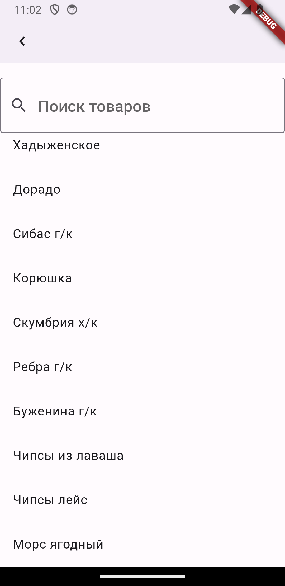

Это мобильное приложение дорабатывается для упрощения и автоматизации заказа еды из Заведения "Хмельная лавка". Приложение позволяет просматривать меню и делать заказы, отслеживать статус заказов, получать скидки, управлять своими учетными данными через систему аунтефикации Firebase.

<p align="center">
  
  
  
  
</p>


**Особенности:**

**Просмотр меню**: Пользователи могут просматривать доступные блюда и напитки.

**Оформление заказов**: Регистрация и вход через Firebase с помощью почты или номера телефона.
**Управление заказами**: Просмотр текущих историй и прошлых заказов.

**Управление базой данных**: AdminPanel для упрощенного создания/редактирования новых позиций в базе данных.

**Архитектура**: Использование архитектуры Bloc для управление состоянием UI и взаимодействия с базой данных Firebase. 


**Технологии**
Flutter: Версия 3.82.

Dart: Версия 3.82.

Android: Минимальная версия SDK - 21.

**Настройка Firebase**

Для работы приложения необходимо настроить Firebase и сгенерировать файл `firebase_options.dart`, содержащий конфигурационные данные вашего Firebase проекта. 

1. Посетите [Firebase console](https://console.firebase.google.com/) и создайте новый проект.
2. Добавьте Android приложение в ваш Firebase проект, следуя инструкциям в консоли.
3. Скачайте файл `google-services.json` и поместите его в папку `android/app` вашего проекта.
4. Используйте Firebase CLI для генерации файла `firebase_options.dart`, выполнив следующую команду в корне вашего Flutter проекта:

Для более подробной информации обратитесь к документации FlutterFire.

```sh
flutterfire configure

